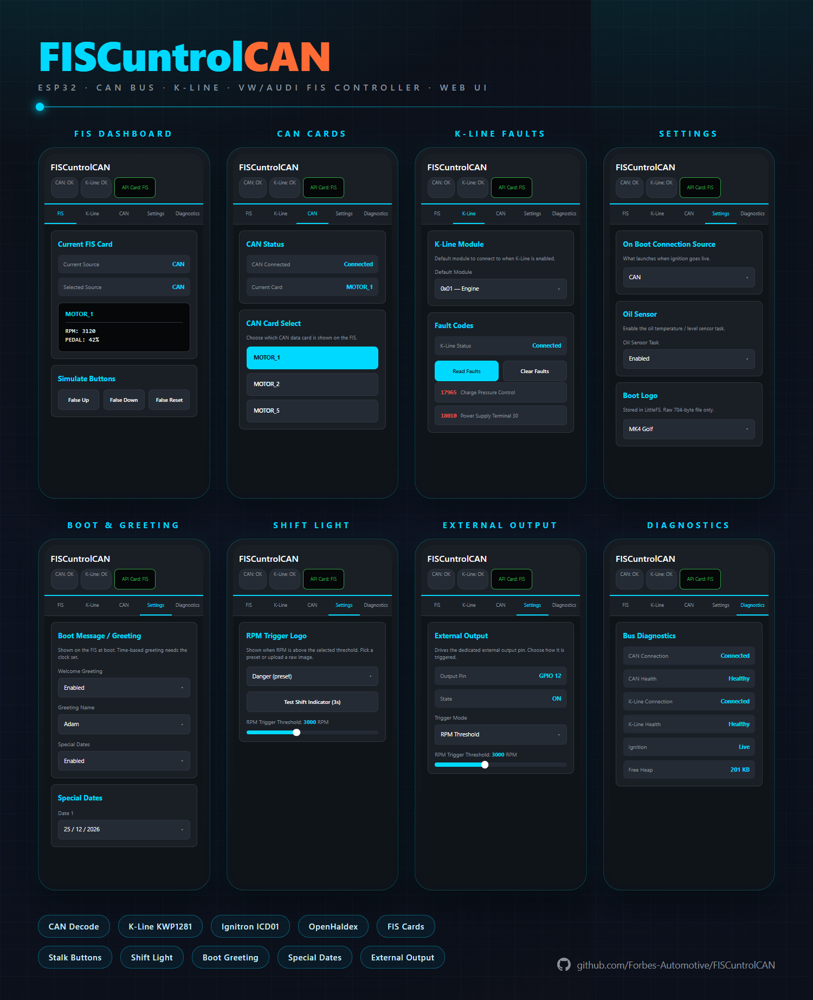
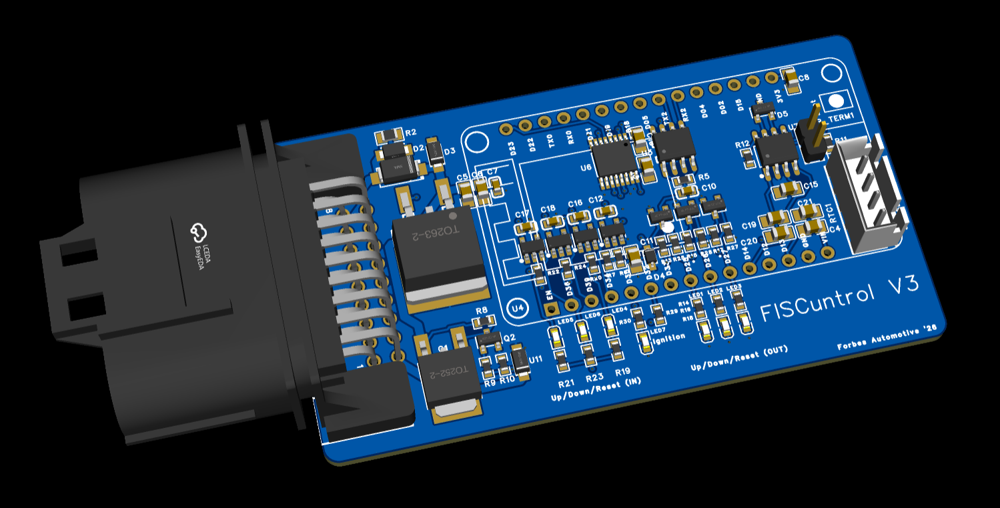
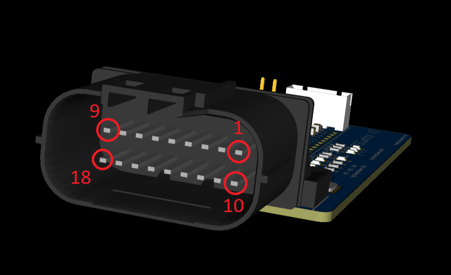
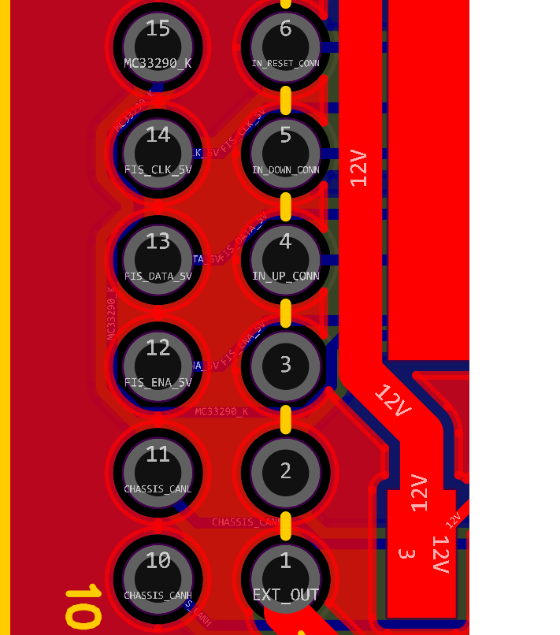
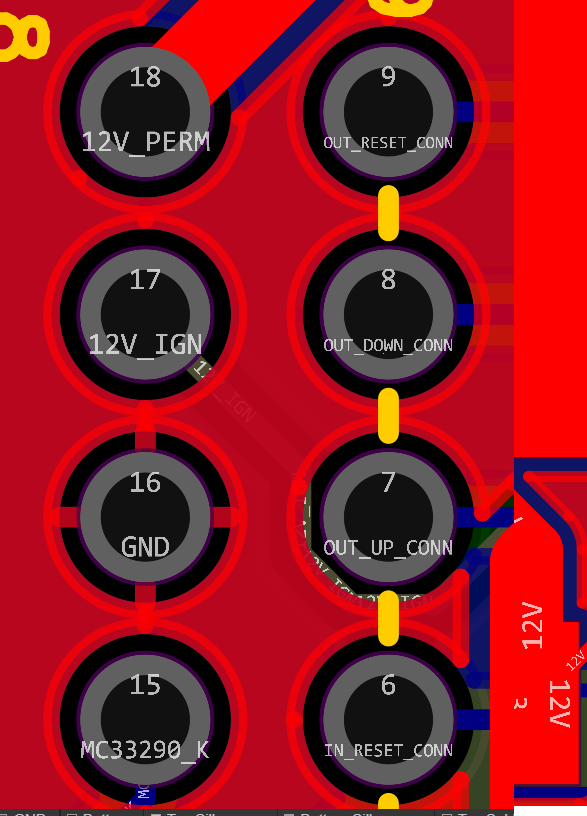
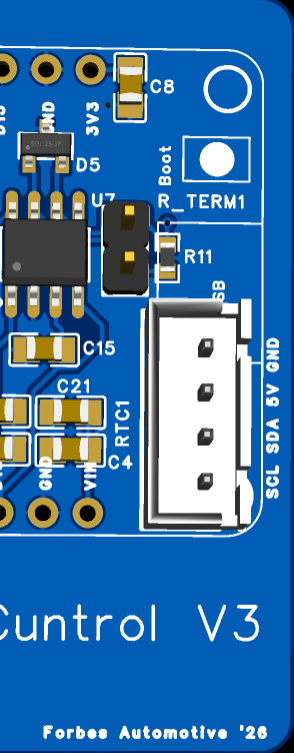

# FISCuntrolCAN



FISCuntrolCAN turns the **FIS** — the driver-information display in the middle of a VW/Audi instrument cluster — into a live data screen for your engine and chassis. It reads the car's **chassis CAN bus** (speed, RPM, pedal, Haldex, EML/EPC) and can also talk **KWP1281 over K-line** for diagnostic measuring blocks and fault codes, then displays it all onto the cluster as scrollable "cards" you flick through with the wiper-stalk buttons. It additionally decodes a standalone **Ignitron** ECU broadcast, co-operates with an **OpenHaldex** controller, and is configured entirely from a phone over **Wi-Fi** — no laptop or serial cable needed in the car. OTA updates and live diagnostics.

It is based on an **ESP32 DevKit V1 (WROOM-32)** running the Arduino framework, and is built around the excellent [TLBFISLib](https://github.com/domnulvlad/TLBFISLib), [KLineKWP1281Lib_ESP32](https://github.com/domnulvlad/KLineKWP1281Lib_ESP32) and [TLBLib](https://github.com/domnulvlad/TLBLib) libraries by `domnulvlad`, which implement the proprietary 3-wire FIS protocol and the KWP1281 diagnostic protocols.

---

## Features at a Glance

| Feature | Detail |
|---|---|
| CAN input | 500 kbit/s TWAI, accept-all filter — VAG MOTOR / Haldex / Ignitron decoders |
| K-line input | KWP1281 measuring blocks + fault-code read/clear (Engine, Gearbox, ABS, Airbag, Cluster) |
| FIS output | Live "cards" drawn over the proprietary 3-wire FIS bus via a level shifter |
| On-screen menu | Stalk-button driven SOURCE menu (K-Line / CAN / Ignitron / Haldex / Settings / Exit) |
| Ignitron view | Decodes the dashCAN "ICD01" sensor broadcast on `0x600–0x604` into paged cards |
| OpenHaldex | Broadcasts mode + pedal threshold + override so a Haldex controller can co-operate |
| Stalk control | Mimics / pulses the three stalk-button outputs to drive the cluster's own menus |
| Wi-Fi UI | Web app — config, diagnostics, OTA |
| OTA updates | Firmware **and** filesystem (web UI) flashed from the browser |
| Boot screens | Selectable splash bitmaps, or a personalised time-of-day greeting |
| Special dates | Up to 5 custom multi-line messages shown on matching calendar days (override the logo) |
| Device clock | Browser-synced time (no NTP needed in AP mode), optional DS1307 RTC, persisted to EEPROM |
| RPM shift light | Full-screen logo overlay above a configurable RPM threshold |
| Oil sensor | Optional single-wire Hella/VAG G266 oil level + temperature decoder *WIP* |
| Power management | Auto Wi-Fi-off + CPU scaling 1 min after the last client disconnects |
| Remembers settings | Nav state and configuration stored to ESP32 Preferences (NVS) |

---

## Compatibility

Designed for VW/Audi clusters that carry a **FIS** driven by the 3-wire
(`ENA` / `CLK` / `DATA`) protocol — e.g. MK4 Golf / Bora, B5–B6 Passat, and
contemporary Audi A3 / A4 / TT clusters. CAN decoding targets the classic VAG
powertrain frame set (`MOTOR1/2/5`, `HALDEX`), and K-line targets KWP1281
control modules. The Ignitron view targets the dashCAN "ICD01" custom-CAN
broadcast.

> Frame IDs, decoders and calibration are car-specific. Treat the supplied
> decoders as a known-good MK4 baseline and adjust [`config.h`](include/config.h)
> to suit your vehicle.

---

## Hardware Overview

### External Interfaces

| Function            | Part / circuit                                                   |
| ------------------- | ---------------------------------------------------------------- |
| CAN transceiver     | TJA1050 / MCP2551 / SN65HVD230 — 500 kbit/s                       |
| K-line transceiver  | KWP1281-capable transceiver (e.g. L9637, MC33290)                |
| FIS bus             | 5 V cluster lines through a CJ74LVC4T245 level shifter (bidirectional `ENA`, unidirectional `CLK` / `DATA`) |
| Stalk buttons       | One isolated input + one isolated output per stalk button (UP / DOWN / RESET) |
| Ignition sense      | Resistor divider into GPIO 35 (ADC, with hysteresis)             |
| External output     | GPIO for switching an aux load via a driver              |
| Optional RTC        | DS1307 on I²C (SDA GPIO 21 / SCL GPIO 22) — enable with "Use RTC" in the UI |
| Optional oil sensor | 12 V → 3.3 V level-shifted PWM signal on GPIO 4 *WIP*                  |

### Pin Map

Defined in [`include/config.h`](include/config.h):

| Group        | Signal                            | GPIO            |
| ------------ | --------------------------------- | --------------- |
| FIS (SPI)    | CLK                               | 18              |
|              | DATA (MOSI)                       | 23              |
|              | ENA (CS)                          | 19              |
|              | ENADIR (level-shifter direction)  | 32              |
| K-line       | TX / RX                           | 17 / 16         |
| CAN / TWAI   | RX / TX                           | 13 / 14         |
| Stalk in     | UP / DOWN / RESET                 | 34 / 39 / 36    |
| Stalk out    | UP / DOWN / RESET                 | 27 / 26 / 25    |
| Misc         | Ignition (ADC)                    | 35              |
|              | External output                   | 12              |
|              | Oil sensor (optional)             | 4               |
|              | RTC I²C SDA / SCL (optional)      | 21 / 22         |

> **Input-only pins:** GPIO 34 / 36 / 39 have no internal pull-ups. The PCB
> must supply the pull-ups for the stalk inputs and the ignition-sense divider.

### Board

The reference hardware is the **FISCuntrol V3** board (Forbes Automotive),
built around an ESP32 DevKit V1 (WROOM-32) with an on-board switching
regulator, CAN and K-line transceivers, the FIS level shifter, and a single
18-way MX23A18NF1 connector.



### Harness Connector

All vehicle wiring lands on one **18-way** MX23A18NF1 connector (two rows of 9). Pin 1 is
top-right, pin 9 top-left; pin 10 is bottom-right, pin 18 bottom-left when
looking into the mating face.



| Pin | Silk name         | Function                                   | Internal net / GPIO         |
| --- | ----------------- | ------------------------------------------ | --------------------------- |
| 1   | `EXT_OUT`         | Switched external / aux output             | GPIO 12                     |
| 2   | —                 | Not connected                              | —                           |
| 3   | —                 | Not connected                              | —                           |
| 4   | `IN_UP_CONN`      | Stalk **UP** button input                  | GPIO 34                     |
| 5   | `IN_DOWN_CONN`    | Stalk **DOWN** button input                | GPIO 39                     |
| 6   | `IN_RESET_CONN`   | Stalk **RESET** button input               | GPIO 36                     |
| 7   | `OUT_UP_CONN`     | Stalk **UP** output (drive to cluster)     | GPIO 27                     |
| 8   | `OUT_DOWN_CONN`   | Stalk **DOWN** output (drive to cluster)   | GPIO 26                     |
| 9   | `OUT_RESET_CONN`  | Stalk **RESET** output (drive to cluster)  | GPIO 25                     |
| 10  | `CHASSIS_CANH`    | Chassis CAN High                           | CAN transceiver (RX 13)     |
| 11  | `CHASSIS_CANL`    | Chassis CAN Low                            | CAN transceiver (TX 14)     |
| 12  | `FIS_ENA_5V`      | FIS **ENA** (5 V, bidirectional)           | GPIO 19 via CJ74LVC4T245    |
| 13  | `FIS_DATA_5V`     | FIS **DATA** (5 V)                         | GPIO 23 via CJ74LVC4T245    |
| 14  | `FIS_CLK_5V`      | FIS **CLK** (5 V)                          | GPIO 18 via CJ74LVC4T245    |
| 15  | `MC33290_K`       | K-line (KWP1281) via MC33290 transceiver   | GPIO 17 / 16 (TX / RX)      |
| 16  | `GND`             | Ground                                     | GND                         |
| 17  | `12V_IGN`         | Ignition-switched 12 V (ignition sense)    | ADC GPIO 35 (divider)       |
| 18  | `12V_PERM`        | Permanent 12 V supply                      | Regulator input             |

<details>
<summary>Silkscreen close-ups</summary>

| Pins 1–6 · 10–15 | Pins 6–9 · 15–18 |
| --- | --- |
|  |  |

</details>

### Status LEDs

The board carries seven indicator LEDs for at-a-glance stalk and ignition I/O.


| LED            | Group                    | Indicates                                          |
| -------------- | ------------------------ | -------------------------------------------------- |
| LED1–LED3      | Up / Down / Reset **OUT**| Board is pulsing an output to the cluster          |
| LED4–LED6      | Up / Down / Reset **IN** | A stalk button input is active                     |
| LED7           | Ignition                 | `12V_IGN` is live (ignition on)                    |

### CAN Termination &amp; RTC



| Feature        | Detail                                                                    |
| -------------- | ------------------------------------------------------------------------- |
| `TERM1` jumper | Fit to enable the **120 Ω** CAN bus termination; leave open when the board is not at the end of the bus |
| `RTC1` connector | 4-pin I²C header (`SCL` / `SDA` / `5V` / `GND`) for an optional DS1307 RTC module — enable with **Use RTC** in the UI (SDA GPIO 21 / SCL GPIO 22) |
| `BOOT` button  | ESP32 boot / flash button                                                 |

---

## How the Display Works

Multiple data sources feed a single shared "card" that the render task paints
onto the FIS. Only one source is shown at a time; the active source is chosen
by the on-screen menu and the stalk buttons.

```
CAN bus (500k)            K-line (KWP1281)        Ignitron ICD01 (0x600–0x604)
      │                         │                            │
      ▼ canTask (core 0)        ▼ klineTask (core 0)         ▼ canTask
 decode MOTOR1/2/5,        measuring blocks             capture frames,
 OpenHaldex, Ignitron      + fault codes                decode 16-bit signals
      │                         │                            │
      └────────────────┬────────┴────────────────────────────┘
                       ▼  shared globals  +  card store (FIS-line mutex)
                       ▼  parseFIS()  →  fisLine[0..7]
                       ▼  fisRenderTask (core 1)
                       ▼  TLBFISLib  →  FIS cluster screen
```

### Card Sources

| Source     | Shows                                                              |
| ---------- | ----------------------------------------------------------------- |
| `CAN`      | Decoded MOTOR cards — RPM & pedal, speed, EML/EPC, plus raw bytes  |
| `IGNITRON` | Paged Ignitron ICD01 sensor values (6 signals per card)           |
| `K-LINE`   | KWP1281 measuring-block values for the selected module            |
| `HALDEX`   | OpenHaldex mode, lock target, engagement, speed, pedal            |

### On-Screen Menu

Long-press **RESET** opens the **SOURCE** menu. Items appear only when their
hardware is available:

`K-LINE` (→ module sub-menu) · `CAN` · `IGNITRON` · `HALDEX` · `EXIT`

### Stalk Buttons

The three stalk buttons are read with [OneButton](https://github.com/mathertel/OneButton)
(single / double / long-press) and their meaning depends on the active source:

| Gesture            | In a menu        | CAN / Ignitron       | Haldex            | K-line            |
| ------------------ | ---------------- | -------------------- | ----------------- | ----------------- |
| UP — single        | Navigate up      | Next card / page     | Mode +            | Block +1          |
| DOWN — single      | Navigate down    | Previous card / page | Mode −            | Block −1          |
| UP — double        | —                | —                    | —                 | Block +10         |
| DOWN — double      | —                | —                    | —                 | Block −10         |
| UP — long          | —                | **Toggle CAN ↔ OpenHaldex** (returns to the last CAN view) |||
| DOWN — long        | —                | —                    | —                 | Block → 1         |
| RESET — single     | Select item      | Open menu            | Open menu         | Open menu         |
| RESET — long       | Close menu       | Open menu / re-enable FIS (toggles FIS off if not booted) |||

> **Last-CAN-view memory:** the long-press-UP toggle simply flips between
> OpenHaldex and the CAN view you last selected. If you were on `CAN` it
> toggles CAN ↔ OpenHaldex; if you were on `IGNITRON` it toggles
> Ignitron ↔ OpenHaldex. The choice persists across power cycles (EEP).

---

## Data Sources

### CAN Decoders

The TWAI controller runs at **500 kbit/s** with an accept-all filter, so every
frame on the bus reaches the firmware. Built-in VAG decoders:

| Frame         | ID      | Decoded into                          |
| ------------- | ------- | ------------------------------------- |
| `MOTOR1`      | `0x280` | `vehicleRPM`, `pedValue`              |
| `MOTOR2`      | `0x288` | `vehicleSpeed` (km/h, optional → mph) |
| `MOTOR5`      | `0x480` | `vehicleEML`, `vehicleEPC`            |
| `openHaldex`  | `0x6B0` | Haldex state, engagement, mode, speed |
| Ignitron ICD01| `0x600`–`0x604` | See [Ignitron View](#ignitron-view) |

### K-line (KWP1281)

When the boot source is K-line, the firmware connects to a control module over
the K-line and polls measuring blocks. The menu's **K-LINE** sub-menu selects
the module; reconnects are handled live with ret/fallback.

| Module  | Address |
| ------- | ------- |
| Engine  | `0x01`  |
| Gearbox | `0x02`  |
| ABS     | `0x03`  |
| Airbag  | `0x22`  |
| Cluster | `0x23`  |

Fault codes can be read and cleared from the web UI's **K-Line** tab.

### Ignitron View

The Ignitron standalone ECU broadcasts the dashCAN **"ICD01"** custom message
set on frames `0x600–0x604`. Each frame packs four little-endian 16-bit
signals; FISCuntrolCAN captures the frames, decodes the signals (reversing the
dashCAN scale/offset) and shows them as paged cards — **6 signals per card**,
so the 20-signal map fills four pages (`IGN 1/4` … `IGN 4/4`). Page with the
UP/DOWN stalk buttons.

Decoded signals include RPM, coolant, MAP, IAT, EGT, oil pressure/temperature,
fuel rail pressure, lambda, pedal, speed, throttle position, battery voltage,
ignition advance, short/long fuel trims and ECU torque. 

### OpenHaldex

When Haldex hardware is present, a background task broadcasts a FISCuntrol
frame (`0x6A0`) carrying the selected mode every 50 ms, and reads the
OpenHaldex status frame (`0x6B0`). Modes: **Stock, FWD, 50/50, 60/40, 75/25,
Expert**. Change mode with UP/DOWN while the Haldex card is shown.

---

## Wi-Fi & Web Interface

Connect to the **`FISCuntrolCAN`** Wi-Fi access point and browse to
**`http://192.168.1.1/`**. The interface is a web app served from the
ESP32's LittleFS partition; settings auto-save to NVS.

| Tab             | Purpose                                                                 |
| --------------- | ----------------------------------------------------------------------- |
| **FIS**         | Live FIS card preview, software stalk-button simulator, ignition restart |
| **K-Line**      | Fault-code viewer + clear, module selector                              |
| **CAN**         | CAN data card carousel                                                  |
| **Settings**    | Boot source (CAN / K-line), boot screen, welcome greeting + name, special dates, Use RTC, per-category logging toggles, RPM-logo threshold, pin assignments, K-line default module |
| **Logos**       | Upload a 704-byte boot bitmap or RPM-overlay bitmap                     |
| **Diagnostics** | CAN / K-line health, ignition state, free heap, FIS boot readiness, raw button-pin states, external-output control, device clock (browser / device / RTC time + RTC status) |
| **OTA**         | Flash new firmware or a new filesystem image from the browser          |

---

## Boot Greeting, Special Dates & Clock

The boot screen can show a **personalised greeting** instead of a logo. With
**Welcome Greeting** enabled in the **Settings** tab you enter a name only and
the device uses the time of day — `GOOD MORNING / AFTERNOON / EVENING
<name>`. The greeting and a boot logo are mutually exclusive (turning the
greeting on clears the selected logo).

**Special Dates** let you define up to **five** calendar days, each with its own
custom multi-line message. On a matching day the message is shown on boot and
**overrides the logo** for that day — even if the Welcome Greeting is off. A
date left at the `1970` is treated as unset.

Both features need the clock time. The browser POSTs its local
date/time to `/api/time` on every page load, the ESP32 advances that time with
its internal clock and **persists it to EEP** so a reboot still has an
approximate time. Enable **Use RTC** to additionally read/write a **DS1307**
on `SDA = GPIO 21` / `SCL = GPIO 22`; when present and running the RTC is
preferred on boot and kept in sync whenever the browser sets the time.

The **Diagnostics** tab's *Device Clock* panel shows the live **browser** time,
the **device** time, the **RTC** time, and the **RTC status**
(*Healthy* / *Not healthy* / *Not detected*). All greeting, special-date,
name and Use-RTC settings are stored in EEP.

---

## Power Management

The firmware bundles the universal `power_manager` module (shared with
SpeedPulser Pro / Can2Cluster) that **1 minute after the last
Wi-Fi client disconnects** will reduce CPU usage and turn off WiFi.  This reduces power consumption / heat generated.

| Action                                   | Saving                                   |
| ---------------------------------------- | ---------------------------------------- |
| Wi-Fi radio off                          | ~80–120 mA average (single biggest)      |
| CPU 240 MHz → 80 MHz                      | Moderate reduction in active current     |
| Bluetooth controller released at boot    | ~60 KB RAM freed; small idle saving      |
| Onboard LED off at boot                  | Tiny but persistent saving               |

A power-cycle (ignition off/on) brings Wi-Fi back.

---

## Oil Sensor (Optional)
**Work In Progress!**
Decodes a single-wire Hella / VAG combined **oil-level + oil-temperature**
sensor (G266 family, OE PNs around `1J0907660*` / `06A907660*`). Disabled by
default (`hasOilSensor 0`).

- The sensor is treated as a **continuous ~18–30 Hz PWM** (not the BMW/Hella
  3-pulse frame): each cycle's **period** is mapped to oil temperature via a
  two-point linear fit, then EMA-filtered.
- The temperature fit is seeded from real MK4 G266 captures
  (~36.5 ms ≈ 20 °C, ~54 ms ≈ 100 °C). Re-check it against a dash / CAN
  oil-temperature reading.
- Oil **level** is *not* calibrated yet (`oilSensorLevelCalibrated 0`, level
  returns `NAN`) — the captures were made in water with the level pad dry.

**To calibrate:**

1. In [`config.h`](include/config.h) set `hasOilSensor 1` and `oilSensorRawLog 1`.
2. Wire the sensor's signal via a 12 V → 3.3 V level shifter to GPIO 4
   (change `oilSensorPin` for a different GPIO).
3. Watch Serial — every cycle prints
   `[OIL] period=… us (… Hz)  high=… us  low=… us  duty=…%  T=…C  cyc=… err=…`.
4. Tune the `oilSensor*` defines (`oilSensorTempPeriod0Us/…1Us` for temperature;
   the `…Period…/…Pulse…Min/Max` sanity windows) until `oilSensorFrameCount`
   rises and the temperature looks sane. For level, run an oil-bath depth test,
   set `oilSensorLevelCalibrated 1` and fill in `oilSensorLevelPulse0Us/…1Us`.

```cpp
void  setupOilSensor();                 // call from setup()
void  serviceOilSensor();               // call from loop()
float oilSensor_getTemperatureC();      // NAN if stale
float oilSensor_getLevelMm();           // NAN if stale
float oilSensor_getLevelPercent();      // 0..100, NAN if stale
bool  oilSensor_isPresent();
bool  oilSensor_hasValidReading();
```

---

## Configuration

### Feature Toggles

| Define              | Default | Effect                                              |
| ------------------- | ------- | --------------------------------------------------- |
| `enableDebug`       | 1       | Mirror `DEBUG(...)` output to Serial.               |
| `serialBaud`        | 115200  | UART speed for the debug console.                   |
| `ChassisCANDebug`   | 0       | Print every incoming TWAI frame.                    |
| `checkLED`          | 0       | Run a one-shot LED test at boot.                    |
| `detailedDebugWiFi` | 0       | Verbose Wi-Fi events.                               |
| `hasRTC`            | 0       | Legacy compile flag; the DS1307 RTC is now toggled at runtime via **Use RTC** in the UI. |
| `isMPH`             | 1       | Convert km/h → mph (`mphFactor` constant).          |
| `hasOilSensor`      | 0       | Compile in the oil-sensor decoder.                  |
| `oilSensorRawLog`   | 0       | Print every decoded oil-sensor pulse to Serial.     |
| `defaultBootScreen` | 2       | 0=off, 1=text, 2=MK4Golf, 3=logo, 4=finger, 5=BMP.  |

### Timing Knobs

`fisWakeDelay`, `fisBootTimeoutMs`, `bootScreenDuration`, `logFrequency`,
`canRefresh`, `connectionDelayDuration`, `fisStatusCardHoldMs` — tune per car
if the cluster behaves differently.

---

## Software Architecture

The Arduino `loop()` runs on **core 1**; CAN reception and other long-lived
jobs run as dedicated FreeRTOS tasks on **core 0**.

### Modules

| Module        | Responsibility                                                              |
| ------------- | --------------------------------------------------------------------------- |
| `config.*`    | All compile-time defines, pin map, CAN IDs, shared globals + `extern` decls |
| `main.cpp`    | `setup()` / `loop()`, ignition status, button-output + oil-sensor monitoring |
| `onboot.cpp`  | GPIO init, boot sequence, connection launch/shutdown |
| `tasks.cpp`   | FreeRTOS task creation (CAN RX, FIS render, K-line poll, Haldex broadcast)  |
| `can_bus.cpp` | TWAI driver + frame capture; MOTOR + Ignitron card decode/render |
| `kline.cpp`   | KWP1281 measuring-block reads + fault-code clear via Serial2                |
| `fis_display.cpp` | TLBFISLib wrapper + rendering                                 |
| `fis_menu.cpp`| On-FIS SOURCE menu                             |
| `cards.cpp`   | FIS "card" store with source switching (mutex-protected)        |
| `buttons.cpp` | OneButton wrappers for the stalk inputs + stalk-output pulse generator      |
| `bootLogos.cpp` / `bootmessage.cpp` | Boot splash bitmaps + user-configurable greeting / special-date messages |
| `timekeeper.cpp` | Device clock — browser time sync, optional DS1307 RTC, EEP        |
| `web_server.cpp` | Wi-Fi AP + AsyncWebServer, JSON API, OTA, LittleFS-served UI             |
| `oil_sensor.cpp` | Optional Hella oil-level + temperature decoder                          |

### FreeRTOS Tasks

| Task         | Core | Priority | Job                                               |
| ------------ | ---- | -------- | ------------------------------------------------- |
| `CAN_RX`     | 0    | 2        | Drain TWAI, update telemetry globals, feed Ignitron |
| `FIS_RENDER` | 1    | 2        | Render menu / card / RPM overlay / K-line / Haldex |
| `KLINE_POLL` | 0    | 1        | Poll KWP1281 measurements, handle module reconnect |
| `OH_BCAST`   | 0    | 1        | Broadcast OpenHaldex frame (50 ms cadence)        |

### `setup()` Order

1. `Serial.begin()` (if `enableDebug` / `ChassisCANDebug`)
2. `setupWiFi()` → `setupWebServer()` → `timeInit()`
3. `powerInit()` — start the background power-manager task
4. `initCardMutex()` — **before** any task that calls `commitCard()` / `displayFIS()`
5. `setupPins()` — GPIO directions, pull-ups, external output
6. `setupButtons()` — stalk OneButton handlers + ISRs
7. `setupOilSensor()` — attaches the edge ISR if `hasOilSensor` is on
8. `startTasks()` — launch the FreeRTOS tasks above

### `loop()` Services

ADC ignition sampling with hysteresis (20 ms) · button-output pulse servicing ·
oil-sensor pulse decode · ignition rise/fall → boot/shutdown · FIS enable/disable
toggle · 200 ms diagnostic Serial print.

---

## Technical Reference

### CAN / TWAI

| Parameter | Value                         |
| --------- | ----------------------------- |
| Baud      | 500 kbit/s                    |
| Mode      | Normal, accept-all filter     |
| Driver    | ESP-IDF `driver/twai.h` (native) |

### Key CAN IDs

| ID            | Use                          |
| ------------- | ---------------------------- |
| `0x280` / `0x288` / `0x480` | VAG `MOTOR1` / `MOTOR2` / `MOTOR5` |
| `0x600`–`0x604` | Ignitron ICD01 sensor broadcast |
| `0x6A0`       | FISCuntrol → OpenHaldex mode |
| `0x6B0`       | OpenHaldex → FISCuntrol status |

### PlatformIO Dependencies

| Library | Purpose |
| ------- | ------- |
| `me-no-dev/ESPAsyncWebServer` + `me-no-dev/AsyncTCP` | Async web server + TCP |
| `bblanchon/ArduinoJson` | JSON for the REST API |
| `mathertel/OneButton`   | Stalk-button gesture decoding |
| `adafruit/RTClib`       | Optional DS1307 RTC |
| `domnulvlad/TLBFISLib`  | FIS rendering over the 3-wire bus |
| `domnulvlad/KLineKWP1281Lib_ESP32` | KWP1281 diagnostic stack |
| `domnulvlad/TLBLib`     | Low-level FIS transport |

Platform: `pioarduino/platform-espressif32` 54.03.20 (Arduino-ESP32 3.x / ESP-IDF 5.x).

---

## Version History

| Version | Highlights |
| ------- | ---------- |
| **Unreleased** | Personalised boot **Welcome Greeting** (name only; device adds the time-of-day prefix) and **5 configurable special-date** messages that override the boot logo. New **timekeeper** module: browser-synced device clock (`/api/time`), optional **DS1307 RTC** on SDA 21 / SCL 22, and NVS persistence of the epoch. **Diagnostics** gained a *Device Clock* panel showing browser / device / RTC time plus RTC health. All new settings persisted to NVS. |
| **Logging & task refactor** | Categorised serial/UI logging (**SYS / CAN / K-LINE / IO / WIFI**) with per-category toggles in the UI; `parseFIS()` moved into `fis_display`, CAN tasks consolidated into `can_bus`; dedicated FreeRTOS tasks for ignition fallback, button outputs and the (UI-disable-able) oil sensor. |
| **Baseline** | CAN + K-line + Ignitron + OpenHaldex unified card system, Wi-Fi single-page UI, OTA (firmware + filesystem), RPM shift-light overlay, optional oil-sensor decoder and the shared power-management module. |

---

## Disclaimer

FISCuntrolCAN displays vehicle data for information only and interfaces with a
vehicle's diagnostic and CAN buses. Always assume readings are approximate.
Use at your own risk — incorrect frame IDs, decoders or wiring can affect bus
behaviour. Test on the bench before fitting to a car.
